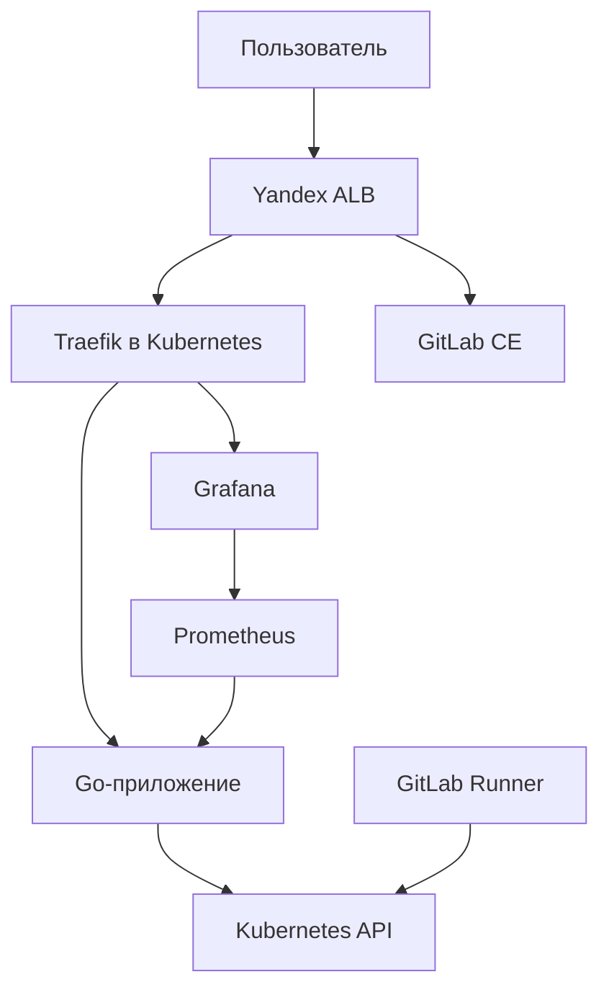
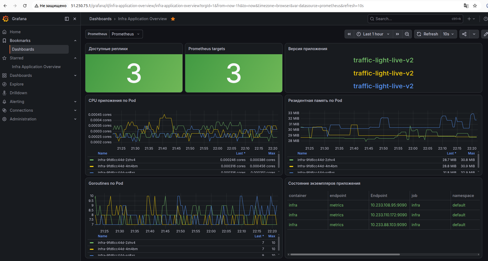

# ДИПЛОМНЫЙ ПРАКТИКУМ

## Автоматизированная облачная платформа развёртывания, эксплуатации и мониторинга контейнеризированного приложения в Yandex Cloud

**Отчёт о проектной работе**  
**Направление:** DevOps-инженер  
**Исполнитель:** В. Горшков  
**Репозиторий:** [github.com/vegorshkov/diplom-devops](https://github.com/vegorshkov/diplom-devops)  
**Год выполнения:** 2026

---

## РЕФЕРАТ

Отчёт содержит описание автоматизированной облачной платформы развёртывания, эксплуатации и мониторинга контейнеризированного приложения в Yandex Cloud.

Объектом проектирования является автоматизированная система, обеспечивающая создание облачной инфраструктуры, формирование отказоустойчивого Kubernetes-кластера, публикацию прикладных сервисов, централизованный мониторинг и выполнение операций непрерывной интеграции.

Цель работы — разработать воспроизводимую инфраструктурную платформу, в которой конфигурация облачных ресурсов, вычислительного кластера, мониторинга и CI/CD хранится в виде кода и может быть повторно применена автоматизированными средствами.

В работе реализованы облачная сеть и вычислительные ресурсы Yandex Cloud, кластер Kubernetes из шести узлов, публичная точка входа на базе Yandex Application Load Balancer, система мониторинга Prometheus и Grafana, GitLab CE, GitLab Runner с Kubernetes executor, а также отказоустойчивое Go-приложение, отображающее состояние узлов и сервисов в виде светофора.

Основные результаты: инфраструктура управляется Terraform; конфигурация серверов и Kubernetes-компонентов автоматизирована Ansible; приложение развёрнуто в трёх репликах по разным зонам доступности; внешние HTTP-запросы маршрутизируются через ALB и Traefik; GitLab Runner зарегистрирован в Kubernetes; тестовый CI pipeline успешно выполнен; метрики приложения передаются в Prometheus.

**Ключевые слова:** YANDEX CLOUD, TERRAFORM, ANSIBLE, KUBESPRAY, KUBERNETES, CONTAINERD, TRAEFIK, APPLICATION LOAD BALANCER, PROMETHEUS, GRAFANA, GITLAB, CI/CD, GO, INFRASTRUCTURE AS CODE, ОТКАЗОУСТОЙЧИВОСТЬ.

---

## СОДЕРЖАНИЕ

1. [Обозначения и сокращения](#1-обозначения-и-сокращения)
2. [Введение](#2-введение)
3. [Назначение и цели создания системы](#3-назначение-и-цели-создания-системы)
4. [Требования к системе](#4-требования-к-системе)
5. [Архитектура автоматизированной системы](#5-архитектура-автоматизированной-системы)
6. [Реализация обеспечивающих подсистем](#6-реализация-обеспечивающих-подсистем)
7. [Реализация функциональных подсистем](#7-реализация-функциональных-подсистем)
8. [Информационная безопасность](#8-информационная-безопасность)
9. [Испытания и результаты](#9-испытания-и-результаты)
10. [Эксплуатация и восстановление](#10-эксплуатация-и-восстановление)
11. [Ограничения и направления развития](#11-ограничения-и-направления-развития)
12. [Заключение](#12-заключение)
13. [Список использованных источников](#13-список-использованных-источников)
14. [Приложение А. Структура репозитория](#приложение-а-структура-репозитория)
15. [Приложение Б. Контрольные адреса](#приложение-б-контрольные-адреса)
16. [Приложение В. Порядок воспроизведения](#приложение-в-порядок-воспроизведения)
17. [Приложение Г. Матрица выполнения задания](#приложение-г-матрица-выполнения-задания)

---

## 1 Обозначения и сокращения

| Сокращение | Значение |
|---|---|
| АС | автоматизированная система |
| ALB | Application Load Balancer, балансировщик прикладного уровня |
| API | программный интерфейс приложения |
| CI | непрерывная интеграция |
| CD | непрерывная доставка или развёртывание |
| IaC | Infrastructure as Code, инфраструктура как код |
| PDB | PodDisruptionBudget |
| RBAC | ролевая модель управления доступом |
| SA | Service Account, сервисная учётная запись |
| S3 | S3-совместимое объектное хранилище |
| VPC | изолированная виртуальная сеть |
| ВМ | виртуальная машина |

## 2 Введение

Современная эксплуатация прикладных систем требует воспроизводимого создания инфраструктуры, автоматизированного развёртывания, наблюдаемости и устойчивости к отказам отдельных вычислительных узлов. Ручное создание облачных ресурсов и настройка серверов затрудняют повторное развёртывание, повышают вероятность конфигурационного дрейфа и усложняют документирование системы.

В проекте рассматривается не набор отдельных технологий, а единая автоматизированная система. Terraform, Ansible, Kubernetes, Prometheus, Grafana и GitLab выступают средствами реализации функциональных и обеспечивающих подсистем.

Структура настоящего отчёта сформирована с учётом ГОСТ 7.32–2017. Архитектурная декомпозиция выполнена по принципам комплекса стандартов ГОСТ 34: система разделена на функциональные и обеспечивающие подсистемы. README является электронной формой технического отчёта. Требования к печатному оформлению — формат листа, поля, шрифт и сквозная нумерация страниц — применяются при подготовке версии DOCX или PDF.

## 3 Назначение и цели создания системы

### 3.1 Назначение

Система предназначена для автоматизированного развёртывания и эксплуатации контейнеризированного приложения в Yandex Cloud, публикации сервисов через единую точку входа, сбора метрик и выполнения CI-задач.

### 3.2 Цель работы

Целью является создание воспроизводимой облачной платформы, максимально приближенной к промышленной архитектуре с учётом учебных сроков и ограничений бюджета.

### 3.3 Задачи

Для достижения цели выполнены следующие задачи:

1. Подготовлена конфигурация облачной инфраструктуры средствами Terraform.
2. Организовано удалённое хранение Terraform state в S3-совместимом Object Storage.
3. Создан Kubernetes-кластер на виртуальных машинах с помощью Kubespray.
4. Обеспечено распределение control-plane и worker-узлов по трём зонам доступности.
5. Разработано и контейнеризировано тестовое приложение на Go.
6. Настроено отказоустойчивое развёртывание приложения в Kubernetes.
7. Развёрнут стек мониторинга Prometheus, Grafana и Alertmanager.
8. Создана публичная точка входа Yandex ALB с маршрутизацией к приложению, Grafana и GitLab.
9. Развёрнут GitLab CE и Kubernetes GitLab Runner.
10. Выполнено функциональное и отказоустойчивое тестирование системы.

## 4 Требования к системе

### 4.1 Функциональные требования

Система должна:

- создавать облачные ресурсы из декларативного описания;
- формировать Kubernetes-кластер без использования Managed Service for Kubernetes;
- выполнять контейнеризированное приложение не менее чем в трёх репликах;
- сохранять работоспособность приложения при отказе одной реплики;
- публиковать прикладные HTTP-сервисы через единый балансировщик;
- собирать метрики кластера и приложения;
- предоставлять графическое представление состояния инфраструктуры;
- запускать CI-задачи в Kubernetes;
- исключать секреты и локальные файлы авторизации из Git-репозитория.

### 4.2 Требования к надёжности

- control-plane и worker-узлы распределяются по зонам `ru-central1-a`, `ru-central1-d`, `ru-central1-e`;
- приложение запускается в трёх репликах;
- применяется `PodDisruptionBudget` с `minAvailable: 2`;
- используется `RollingUpdate` с ограничением недоступных реплик;
- применяется распределение Pod по различным Kubernetes-узлам;
- ALB направляет трафик на несколько worker-узлов;
- состояние компонентов контролируется health check и системой мониторинга.

### 4.3 Требования к воспроизводимости

- облачные ресурсы описываются Terraform;
- конфигурация серверов и установка компонентов выполняются Ansible;
- Kubernetes-объекты хранятся в YAML-манифестах и Helm values;
- изменения исходного кода и конфигурации фиксируются Git;
- повторный запуск автоматизации должен быть идемпотентным либо приводить систему к описанному целевому состоянию.

## 5 Архитектура автоматизированной системы

### 5.1 Контекст системы



### 5.2 Декомпозиция на подсистемы

| Тип | Подсистема | Назначение | Средства реализации |
|---|---|---|---|
| Функциональная | Управление инфраструктурой | Создание и изменение облачных ресурсов | Terraform, Yandex Cloud Provider |
| Функциональная | Оркестрация приложений | Планирование и поддержание контейнерных нагрузок | Kubernetes, containerd, Kubespray |
| Функциональная | Публикация сервисов | Приём и маршрутизация внешнего трафика | Yandex ALB, Traefik, Ingress |
| Функциональная | Мониторинг | Сбор, хранение и визуализация метрик | Prometheus, Grafana, Alertmanager |
| Функциональная | CI/CD | Выполнение автоматизированных задач проекта | GitLab CE, GitLab Runner, Kubernetes executor |
| Функциональная | Контроль состояния | Отображение узлов и сервисов в виде светофора | Go, Kubernetes API, Metrics API, WebSocket |
| Обеспечивающая | Сетевая | Связность компонентов и исходящий доступ | VPC, подсети, NAT instance, route table, security groups |
| Обеспечивающая | Информационная | Хранение состояния и конфигураций | Git, Object Storage, Terraform state |
| Обеспечивающая | Программная | Среда выполнения компонентов | Ubuntu, containerd, Helm, Ansible |
| Обеспечивающая | Организационная | Порядок развёртывания и контроля | playbook, манифесты, инструкции, README |
| Обеспечивающая | Защитная | Разделение полномочий и защита секретов | IAM, RBAC, Ansible Vault, `.gitignore` |

### 5.3 Размещение компонентов

| Зона | Подсеть | Control-plane | Worker | Дополнительные ресурсы |
|---|---|---|---|---|
| `ru-central1-a` | `172.16.1.0/24` | `172.16.1.10` | `172.16.1.21` | GitLab `172.16.1.100` |
| `ru-central1-d` | `172.16.3.0/24` | `172.16.3.10` | `172.16.3.21` | — |
| `ru-central1-e` | `172.16.4.0/24` | `172.16.4.10` | `172.16.4.21` | — |
| `ru-central1-b` | `172.16.2.0/24` | — | — | NAT instance `172.16.2.254` |

Kubernetes-кластер содержит три control-plane и три worker-узла. Публичные адреса отсутствуют у Kubernetes-узлов; административный доступ выполняется через SSH ProxyJump. Исходящий трафик проходит через NAT instance.

### 5.4 Внешняя маршрутизация

Публичная точка входа: `51.250.75.1:80`.

| Путь | Назначение | Backend |
|---|---|---|
| `/` | инфраструктурное Go-приложение | ALB → Traefik NodePort `30080` → Service `infra` |
| `/grafana/` | Grafana | ALB → Traefik → Service Grafana |
| `/gitlab/` | GitLab CE | ALB → отдельная backend group → `172.16.1.100:80` |

ALB использует статический публичный IPv4-адрес. Target group Kubernetes содержит три worker-узла. Проверки состояния выполняются для Traefik и GitLab. Текущая учебная конфигурация работает по HTTP; доменное имя и TLS-сертификат не используются.

## 6 Реализация обеспечивающих подсистем

### 6.1 Инфраструктурное обеспечение

Terraform-конфигурация размещена в каталоге `terraform_infra`. Она описывает:

- VPC и подсети;
- таблицу маршрутизации;
- NAT instance;
- группы безопасности;
- Kubernetes control-plane и worker-ВМ;
- GitLab VM;
- статический адрес ALB;
- target groups и backend groups;
- HTTP router, virtual host и load balancer.

Состояние Terraform хранится в удалённом S3 backend. Ключ сервисной учётной записи Yandex Cloud и ключи Object Storage не включаются в репозиторий.

### 6.2 Сетевое обеспечение

Сеть разделена на зональные подсети. Kubernetes-узлы взаимодействуют по внутренним адресам. Правила security groups разрешают только требуемые направления: внутрисетевое взаимодействие, проверки ALB, NodePort Traefik, HTTP GitLab и административный SSH-доступ.

### 6.3 Программное обеспечение узлов

На виртуальных машинах используется Ubuntu 22.04 LTS. Kubernetes установлен Kubespray 2.31.0. Версия Kubernetes — 1.35.4, container runtime — containerd 2.2.3.

### 6.4 Конфигурационное управление

Ansible применяется для:

- подготовки и развёртывания Kubernetes с Kubespray;
- установки Helm-компонентов;
- развёртывания мониторинга;
- установки и конфигурации GitLab CE;
- установки GitLab Runner в Kubernetes.

Конфигурация GitLab находится в `ansible_gitlab`, конфигурация Kubernetes — в `ansible_kubespray`. Секрет Runner хранится в зашифрованном Ansible Vault и исключён из Git.

## 7 Реализация функциональных подсистем

### 7.1 Kubernetes

Кластер работает в конфигурации `3 control-plane + 3 worker`. Все узлы имеют состояние `Ready`. Компоненты control-plane распределены по трём зонам, что снижает зависимость от одной зоны доступности.

### 7.2 Прикладная подсистема

Тестовое приложение разработано на Go. Оно предоставляет:

- HTTP-интерфейс на порту `8080`;
- endpoint проверки состояния `/api/health`;
- API состояния инфраструктуры `/api/infrastructure`;
- WebSocket-обновление интерфейса;
- Prometheus-метрики на порту `9090`;
- графическую панель состояния узлов и сервисов.

Приложение использует Kubernetes ServiceAccount `infra-viewer`. Через ограниченный RBAC оно читает сведения об узлах, Pod и Metrics API. Интерфейс отображает реальные значения CPU, RAM, число Pod, uptime и Ready-состояние всех шести узлов.

Состояние сервисов определяется реальными HTTP-проверками:

- Yandex ALB;
- Grafana;
- GitLab;
- Prometheus.

Статусы представлены цветами: зелёный — штатная работа, жёлтый — деградация, красный — ошибка, серый — отсутствие данных.

### 7.3 Отказоустойчивость приложения

Deployment `infra` содержит три реплики. Topology spread размещает по одной реплике на worker-узлах зон `a`, `d`, `e`. PDB сохраняет не менее двух доступных экземпляров при добровольных нарушениях. Service направляет запросы на все готовые endpoints.

### 7.4 Мониторинг

В namespace `monitoring` развёрнут `kube-prometheus-stack`, содержащий:

- Prometheus;
- Grafana;
- Alertmanager;
- kube-state-metrics;
- node-exporter.

Prometheus собирает инфраструктурные метрики и метрики приложения. Grafana опубликована через `/grafana/`. Учётные данные администратора Grafana передаются через Kubernetes Secret, формируемый из Ansible Vault.

### 7.5 GitLab и CI

GitLab CE развёрнут на отдельной ВМ средствами Terraform и Ansible. Внешний URL настроен с относительным путём `/gitlab`. ALB передаёт запросы непосредственно в GitLab backend group.

GitLab Runner установлен Helm-чартом в namespace `gitlab-runner` и использует Kubernetes executor. Для каждого задания создаётся временный Pod. Runner имеет namespace-scoped Role и RoleBinding; cluster-wide RBAC не используется. Runner зарегистрирован и имеет состояние `Online`.

В репозитории присутствует корневой `.gitlab-ci.yml`. Выполнен smoke pipeline, подтвердивший:

- получение задания Runner;
- создание build Pod в Kubernetes;
- клонирование репозитория;
- выполнение скрипта в контейнере;
- успешное завершение pipeline.

Полный конвейер сборки образа, публикации в Container Registry и автоматического CD выделен в дальнейшее развитие и не заявляется как завершённый результат.

Для будущего этапа CD создан ServiceAccount `infra-deployer` и namespaced RBAC в `default`. Учётной записи разрешено получать и изменять только Deployment `infra`, а также читать Deployment, ReplicaSet, Pod, журналы Pod и события, необходимые для контроля rollout. Доступ к Secret и удаление Deployment запрещены.

## 8 Информационная безопасность

### 8.1 Управление секретами

В репозиторий не должны попадать:

- `authorized_key.json`;
- `*.tfvars` с чувствительными значениями;
- ключи S3 backend;
- Ansible Vault с токеном Runner в открытом виде;
- kubeconfig с административными данными;
- приватные SSH-ключи.

Исключения фиксируются в `.gitignore`. Значения токенов не выводятся в журнал автоматизации; для чувствительных Ansible-задач применяется `no_log: true`.

### 8.2 Разграничение доступа

- облачные ресурсы используют IAM-роли;
- Kubernetes-компоненты используют ServiceAccount и RBAC;
- приложение получает права только на чтение необходимых объектов;
- Runner ограничен namespace `gitlab-runner`;
- CD ServiceAccount `infra-deployer` ограничен namespace `default` и не имеет доступа к Secret;
- Kubernetes API не опубликован напрямую в Интернет;
- административный доступ выполняется через SSH aliases и ProxyJump.

### 8.3 Принятые риски

Учебная публикация выполняется по HTTP без TLS. Это допустимо только для демонстрационной среды. Для промышленной эксплуатации необходимы доменное имя, HTTPS listener, сертификат Certificate Manager, редирект HTTP → HTTPS и пересмотр внешней доступности административных интерфейсов.

## 9 Испытания и результаты

### 9.1 Проверка инфраструктуры

Terraform `validate` завершён успешно. Планирование и применение ALB выполнены без пересоздания несвязанных ресурсов. Публичный адрес ALB: `51.250.75.1`.

### 9.2 Проверка Kubernetes

| Показатель | Результат |
|---|---|
| Control-plane | 3/3 Ready |
| Worker | 3/3 Ready |
| Версия Kubernetes | 1.35.4 |
| Container runtime | containerd 2.2.3 |
| Реплики приложения | 3/3 Ready |
| Размещение приложения | worker `a`, `d`, `e` |

### 9.3 Проверка приложения

Endpoint `/api/health` возвращает `status: ok`. Endpoint `/api/infrastructure` возвращает сведения о шести реальных Kubernetes-узлах и четырёх сервисах. Метрики `infra_app_info`, `go_goroutines` и `process_resident_memory_bytes` доступны Prometheus.


### 9.3.1 Dashboard мониторинга приложения

В Grafana добавлен dashboard `Infra Application Overview`, автоматически загружаемый sidecar-контейнером из Kubernetes ConfigMap с меткой `grafana_dashboard=1`.

Dashboard отображает:

- количество доступных реплик Deployment `infra`;
- состояние Prometheus targets приложения;
- текущую версию приложения;
- использование CPU каждым Pod;
- резидентную память каждого Pod;
- количество goroutines;
- состояние отдельных экземпляров приложения.



Адрес dashboard: <http://51.250.75.1/grafana/d/infra-application-overview>.

Dashboard хранится декларативно в файле `k8s_monitoring/dashboards/infra-application-dashboard.yaml` и может быть повторно применён командой `kubectl apply`.

### 9.4 Проверка внешних сервисов

| Сервис | Контрольный результат |
|---|---|
| Приложение | HTTP 200 |
| Grafana | HTTP 302/200, переход к `/grafana/login` |
| GitLab | HTTP 200 для `/gitlab/users/sign_in` |
| Prometheus | HTTP 200 для `/-/ready` внутри кластера |

### 9.5 Проверка отказоустойчивости

При удалении Pod приложения контроллер Deployment создаёт новую реплику. После восстановления сохраняются три готовых экземпляра и распределение по трём worker-узлам. Во время RollingUpdate обновление завершено успешно без одновременной остановки всех реплик.

### 9.6 Проверка CI

GitLab Runner имеет состояние `Online`. Smoke pipeline для ветки `main` завершён со статусом `Passed`. Временный job Pod был создан на worker-узле, выполнил тестовые команды и удалён после завершения задания.

## 10 Эксплуатация и восстановление

### 10.1 Основные проверки

```bash
kubectl get nodes -o wide
kubectl get pods --all-namespaces
kubectl get deployment infra --namespace default
curl -fsS http://51.250.75.1/api/health
curl -fsS http://51.250.75.1/api/infrastructure
```

### 10.2 Повторное применение Terraform

Перед выполнением Terraform необходимо загрузить переменные доступа к S3 backend и использовать ключ авторизации Yandex Cloud Provider. Рекомендуемый порядок: `terraform init`, `terraform validate`, создание сохранённого plan и применение именно проверенного plan.

### 10.3 Повторная конфигурация GitLab

GitLab VM создаётся Terraform, а GitLab CE конфигурируется playbook из `ansible_gitlab`. Внешний URL должен соответствовать пути `/gitlab`, используемому ALB.

### 10.4 Повторная установка Runner

Токен Runner хранится в Ansible Vault. Playbook создаёт namespace и Secret, копирует values, добавляет Helm repository и выполняет `helm upgrade --install`.

### 10.5 Локальный доступ к Kubernetes API

Kubernetes API доступен через SSH tunnel к control-plane. После перезагрузки рабочей станции tunnel необходимо создать повторно; kubeconfig использует локальную точку `https://127.0.0.1:16443` с проверкой TLS-имени control-plane.

## 11 Ограничения и направления развития

На момент подготовки отчёта действуют следующие ограничения:

1. Внешняя публикация работает по HTTP без TLS.
2. Для Grafana, Prometheus и Alertmanager не настроено постоянное дисковое хранилище.
3. GitLab размещён на одной ВМ и не является отказоустойчивым.
4. NAT instance имеет динамический публичный адрес.
5. Выполнен CI smoke test, но полный build/push/deploy pipeline ещё не завершён.
6. Локально собранные демонстрационные образы импортировались в containerd worker-узлов вручную.

При дальнейшем развитии рекомендуется:

- настроить внутренний GitLab Container Registry;
- выполнять непривилегированную сборку образов с BuildKit или Kaniko;
- внедрить автоматический rollout и проверку результата deployment;
- подключить доменное имя и сертификат Yandex Certificate Manager;
- перевести ALB на HTTPS;
- добавить PersistentVolume для компонентов, которым требуется долговременное хранение;
- настроить резервное копирование GitLab;
- добавить алерты на недоступность узлов, сервисов и нехватку ресурсов.

## 12 Заключение

В результате работы создана автоматизированная облачная платформа развёртывания, эксплуатации и мониторинга контейнеризированного приложения в Yandex Cloud.

Система построена как совокупность взаимосвязанных функциональных и обеспечивающих подсистем. Terraform обеспечивает воспроизводимость облачной инфраструктуры, Ansible — конфигурационное управление, Kubernetes — оркестрацию и самовосстановление приложения, Yandex ALB и Traefik — публикацию сервисов, Prometheus и Grafana — наблюдаемость, GitLab и Kubernetes Runner — выполнение CI-задач.

Работоспособность подтверждена практическими испытаниями. Шесть Kubernetes-узлов находятся в состоянии Ready, три реплики приложения распределены по разным worker-узлам, публичные маршруты доступны через ALB, метрики собираются, а CI smoke pipeline завершён успешно.

Таким образом, основные цели дипломного практикума достигнуты. Для завершения полного жизненного цикла CI/CD требуется реализовать автоматическую сборку, публикацию контейнерного образа и контролируемое развёртывание новой версии приложения.

## 13 Список использованных источников

1. ГОСТ 7.32–2017. Система стандартов по информации, библиотечному и издательскому делу. Отчёт о научно-исследовательской работе. Структура и правила оформления. URL: <https://docs.cntd.ru/document/1200157208> (дата обращения: 18.08.2026).
2. Дипломный практикум в Yandex Cloud / Нетология. URL: <https://github.com/netology-code/devops-diplom-yandexcloud> (дата обращения: 18.08.2026).
3. Yandex Cloud Documentation. URL: <https://yandex.cloud/ru/docs/> (дата обращения: 18.08.2026).
4. Terraform Documentation. URL: <https://developer.hashicorp.com/terraform/docs> (дата обращения: 18.08.2026).
5. Yandex Cloud Terraform Provider. URL: <https://terraform-provider.yandexcloud.net/> (дата обращения: 18.08.2026).
6. Kubernetes Documentation. URL: <https://kubernetes.io/docs/> (дата обращения: 18.08.2026).
7. Kubespray Documentation. URL: <https://kubespray.io/> (дата обращения: 18.08.2026).
8. Ansible Documentation. URL: <https://docs.ansible.com/> (дата обращения: 18.08.2026).
9. Prometheus Documentation. URL: <https://prometheus.io/docs/> (дата обращения: 18.08.2026).
10. Grafana Documentation. URL: <https://grafana.com/docs/grafana/latest/> (дата обращения: 18.08.2026).
11. GitLab Documentation. URL: <https://docs.gitlab.com/> (дата обращения: 18.08.2026).
12. GitLab Runner Helm Chart. URL: <https://docs.gitlab.com/runner/install/kubernetes/> (дата обращения: 18.08.2026).
13. Traefik Kubernetes Ingress Documentation. URL: <https://doc.traefik.io/traefik/providers/kubernetes-ingress/> (дата обращения: 18.08.2026).
14. Go Documentation. URL: <https://go.dev/doc/> (дата обращения: 18.08.2026).

---

## Приложение А. Структура репозитория

| Каталог или файл | Назначение |
|---|---|
| `.gitlab-ci.yml` | конфигурация GitLab pipeline |
| `ansible_gitlab/` | установка GitLab CE и GitLab Runner |
| `ansible_kubespray/` | Kubespray, inventory и Ansible playbook кластера |
| `infra/` | исходный код Go-приложения и Dockerfile |
| `k8s_configs/` | Kubernetes-манифесты приложения, RBAC, Service и Ingress |
| `k8s_monitoring/` | конфигурация мониторинга и Grafana |
| `terraform_infra/` | основная инфраструктура Yandex Cloud и ALB |
| `terraform_state/` | bootstrap-конфигурация удалённого Terraform state |
| `archive/` | контрольные копии конфигураций |
| `README.md` | отчёт о выполнении проекта |

## Приложение Б. Контрольные адреса

| Компонент | Адрес |
|---|---|
| Приложение | <http://51.250.75.1/> |
| API состояния | <http://51.250.75.1/api/infrastructure> |
| Grafana | <http://51.250.75.1/grafana/> |
| GitLab | <http://51.250.75.1/gitlab/> |
| Репозиторий GitHub | <https://github.com/vegorshkov/diplom-devops> |

Адреса относятся к учебной инфраструктуре и доступны только во время работы облачных ресурсов.

## Приложение В. Порядок воспроизведения

1. Создать bootstrap-ресурсы Object Storage из `terraform_state`.
2. Подготовить backend credentials без вывода секретов.
3. Инициализировать и применить `terraform_infra` после проверки сохранённого plan.
4. Подготовить SSH aliases и ProxyJump.
5. Запустить Kubespray с inventory проекта.
6. Применить Kubernetes-манифесты приложения.
7. Установить мониторинг Ansible playbook и Helm.
8. Установить Traefik с фиксированным NodePort.
9. Применить Terraform-конфигурацию ALB.
10. Установить и настроить GitLab CE через `ansible_gitlab`.
11. Создать project Runner в GitLab и сохранить токен в Ansible Vault.
12. Установить GitLab Runner в Kubernetes.
13. Выполнить smoke pipeline и функциональные проверки.

## Приложение Г. Матрица выполнения задания

| Требование дипломного практикума | Результат | Статус |
|---|---|---|
| Облачная инфраструктура | VPC, подсети, ВМ, NAT, SG, ALB созданы Terraform | Выполнено |
| Kubernetes-кластер | 3 control-plane и 3 worker, Kubespray | Выполнено |
| Тестовое приложение | Go-приложение, Dockerfile, 3 реплики | Выполнено |
| Система мониторинга | Prometheus, Grafana, Alertmanager, exporters | Выполнено |
| Публикация приложения | Yandex ALB и Traefik | Выполнено |
| Отказоустойчивость приложения | 3 реплики, PDB, topology spread | Выполнено |
| CI | GitLab Runner в Kubernetes, smoke pipeline | Выполнено |
| RBAC для CD | ServiceAccount `infra-deployer` с ограниченными правами | Выполнено |
| Автоматическая сборка образа | Требуется Container Registry и build job | В работе |
| CD приложения | Требуется deploy job с ограниченным RBAC | В работе |
| Документация | Настоящий технический отчёт и конфигурация в Git | Выполнено |
